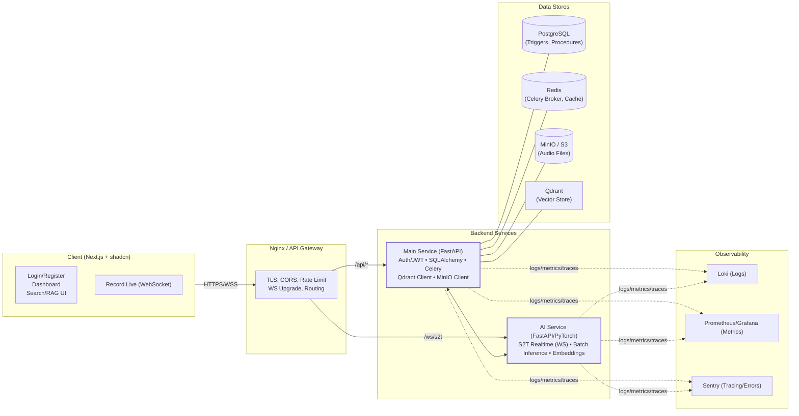

# System Design - BTL Python S2T Project

## Tổng Quan Kiến Trúc

Hệ thống Speech-to-Text (S2T) được thiết kế theo kiến trúc microservices với các thành phần chính:

- **Client Layer**: Giao diện người dùng với khả năng realtime recording qua WebSocket
- **Gateway Layer**: API Gateway xử lý routing, security, và load balancing
- **Core Services**: Backend API và AI inference services
- **Data Layer**: Cơ sở dữ liệu và storage cho dữ liệu, audio files, và vector embeddings
- **Observability**: Monitoring, logging, và error tracking

## Kiến Trúc Chi Tiết

### Luồng Dữ Liệu Chính

1. **Realtime S2T**: Client → WebSocket → AI Service → Stream transcript segments
2. **Batch S2T**: Client → API → Celery Job → AI Service → Store results
3. **User Management**: Client → API → PostgreSQL (users, subscriptions, quota)
4. **RAG Pipeline**: Recording complete → AI Service → Embed chunks → Qdrant → Semantic search

### Công Nghệ Stack

- **Frontend**: Next.js với shadcn/ui cho UI components
- **Backend**: FastAPI cho REST APIs, Celery cho async tasks
- **AI/ML**: Faster-whisper cho S2T, LangChain cho RAG
- **Database**: PostgreSQL với triggers/procedures, Redis cho cache/broker
- **Storage**: MinIO/S3 cho audio files, Qdrant cho vector search
- **Infrastructure**: Nginx gateway, Docker containers
- **Observability**: Loki logs, Prometheus metrics, Grafana dashboards, Sentry tracing

## Flowchart Kiến Trúc

## Giải Thích Flowchart

### Client Layer
- **UI Components**: Xử lý đăng nhập, dashboard, upload files, giao diện RAG
- **WebSocket**: Kết nối realtime cho S2T với VAD (Voice Activity Detection)

### Gateway Layer
- **Security**: TLS encryption, CORS, rate limiting
- **Routing**: Chuyển hướng API calls đến Main Service, WS đến AI Service
- **Load Balancing**: Phân tải requests nếu scale horizontally

### Core Services
- **Main Service**: Xử lý business logic, authentication, database operations, Celery task management
- **AI Service**: Chạy inference cho S2T (realtime/batch), embeddings cho RAG, tích hợp với Qdrant

### Data Layer
- **PostgreSQL**: Lưu trữ users, recordings, segments, subscriptions với triggers tự động cập nhật quota
- **Redis**: Broker cho Celery, cache cho sessions và frequent queries
- **MinIO/S3**: Storage cho audio files uploaded
- **Qdrant**: Vector database cho semantic search và RAG

### Observability
- **Loki**: Centralized logging từ tất cả services
- **Prometheus/Grafana**: Metrics collection và visualization dashboards
- **Sentry**: Error tracking và performance tracing

## Quyết Định Thiết Kế

### Tại Sao Microservices?
- **Scalability**: AI Service có thể scale riêng biệt cho heavy inference workloads
- **Technology Diversity**: AI Service dùng PyTorch, Main Service dùng FastAPI
- **Fault Isolation**: Failure trong AI không ảnh hưởng user management

### Tại Sao Celery cho Batch?
- **Async Processing**: Batch S2T có thể mất thời gian, không block API responses
- **Reliability**: Redis broker đảm bảo jobs không bị mất nếu service restart

### Tại Sao Qdrant cho Vectors?
- **Performance**: Optimized cho vector search với hybrid filtering
- **Integration**: Dễ dàng với LangChain cho RAG pipelines

### Tại Sao MinIO thay vì S3 trực tiếp?
- **Self-hosted**: Không phụ thuộc cloud provider
- **Compatibility**: S3-compatible API cho dễ migration
- 
## Security Considerations

- **API Gateway**: Central point cho authentication, rate limiting, input validation
- **JWT Tokens**: Stateless authentication với refresh tokens
- **Data Encryption**: Audio files encrypted at rest, TLS in transit
- **Quota Enforcement**: Database triggers + backend checks để prevent abuse

## Monitoring & Alerting

- **Metrics**: Response times, error rates, queue lengths, resource usage
- **Alerts**: High error rates, queue backlog, disk space low
- **Tracing**: Distributed tracing với Sentry để debug complex flows
